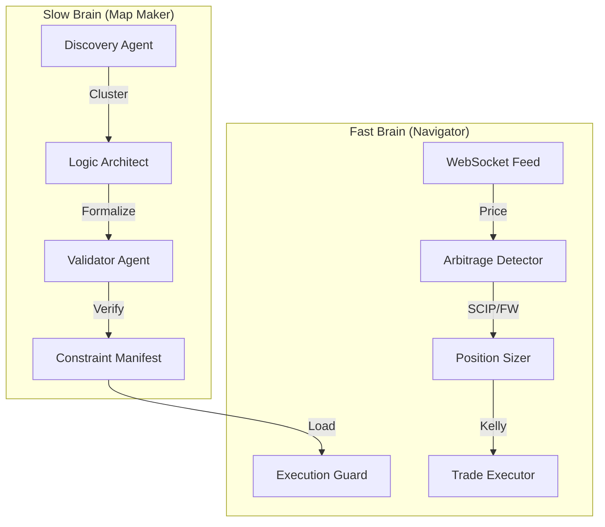

# PolyQuant 2.0

**Autonomous Arbitrage Extraction via Multi-Agent Logical Reasoning**

[](https://www.python.org/downloads/)
[](https://www.rust-lang.org/)
[](https://opensource.org/licenses/MIT)

## 🎯 Overview

PolyQuant 2.0 is a modular agent swarm designed for high-frequency arbitrage on Polymarket. By decoupling deep logical reasoning (Slow Brain) from sub-50ms execution (Fast Brain), it achieves both professional-grade risk management and extreme performance.

## 🏗️ Architecture: The Two-Brain System

PolyQuant operates like a predator: deep analysis offline, instant reaction online.



### 🧠 Slow Brain (Map Maker)
Uses LLMs (Gemini 2.0 Flash/Thinking) to understand market relationships.
- **Ultra-Fast Scanning**: Uses `/events` API with server-side sorting. Scans 130,000+ markets in **~8 seconds**.
- **Auto-Clustering**: NegRisk groups are handled without LLM costs (100% accurate).
- **Logical Formalization**: Translates human text into mathematical constraint matrices ($A^T z \ge b$).

### ⚡ Fast Brain (Navigator)
Uses pre-computed constraints for sub-50ms execution.
- **Event-Driven**: Wakes up on WebSocket price updates.
- **Low Latency**: Barrier Frank-Wolfe solver + SCIP oracle achieves **<50ms tick-to-trade**.
- **Safety First**: Execution Guard, Kill Switch, and Kelly Criterion sizing protect capital.

## 📁 Project Structure

```
polyquant/
├── src/
│   ├── agents/              # AI Agent implementations
│   │   ├── discovery.py     # 3-Phase market scanner (8s full scan)
│   │   ├── logic_architect.py # Dependency detection & matrix generation
│   │   └── validator.py     # Constraint verification (Zero-trust)
│   ├── solver/              # Optimization engine
│   │   ├── fw_solver.py     # Barrier Frank-Wolfe algorithm
│   │   └── scip_solver.py   # SCIP LMO Oracle
│   ├── data/                # Data layer
│   │   ├── polymarket_client.py # Multi-API REST/WS client
│   │   └── price_cache.py   # Event-driven in-memory cache
│   ├── risk/                # Risk management
│   │   ├── position_sizing.py # Modified Kelly Criterion
│   │   └── kill_switch.py   # Auto-halt on drawdown/latency
│   └── main.py              # Single entry point (CLI)
├── manifests/               # Persisted JSON constraint maps
└── PIPELINE_DEEP_DIVE.md    # Definitive technical reference
```

## 🚀 Getting Started

### Prerequisites
- Python 3.11+
- [SCIP Optimization Suite](https://scipopt.org/) installed on system
- Redis (optional, for cross-restart memory)

### Installation
```bash
git clone https://github.com/Fruitcocktailbe/PolyQuant.git
cd PolyQuant
pip install -r requirements.txt
```

### Configuration
Edit `.env` (see `.env.example`):
- `GEMINI_API_KEY`: For Map Maker reasoning.
- `POLYGON_PRIVATE_KEY`: For execution (if live).

### Usage

**1. Create the Map (Offline)**
Scan Polymarket and build the constraint manifest.
```bash
# Scan all markets with $1k+ liquidity (takes ~30s)
python -m polyquant.main map --min-liquidity 1000 --limit 0

# Fast test (top 20 events)
python -m polyquant.main map --limit 20 --force
```

**2. Start Trading (Real-Time)**
Run the Navigator to watch for opportunities.
```bash
python -m polyquant.main trade
```

## 📊 Performance
- **Discovery**: ~8s for full market scan.
- **Tick-to-Trade**: ~44ms (Paper), ~64ms (Live).
- **Memory**: ~80MB footprint.

## 📝 License
MIT License. See [LICENSE](LICENSE) for details.

## ⚠️ Disclaimer
Educational purposes only. Prediction market trading involves risk. Use at your own risk.
